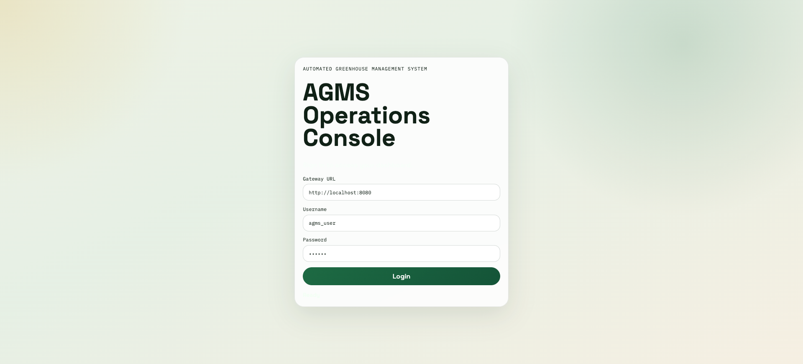
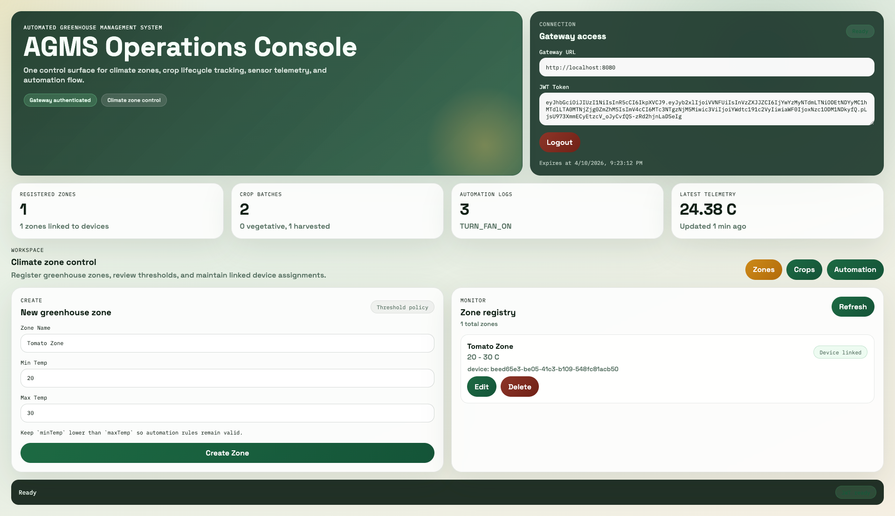
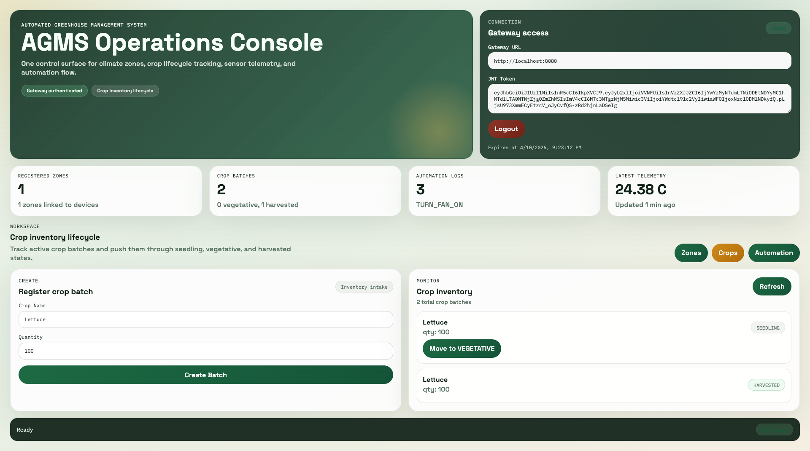
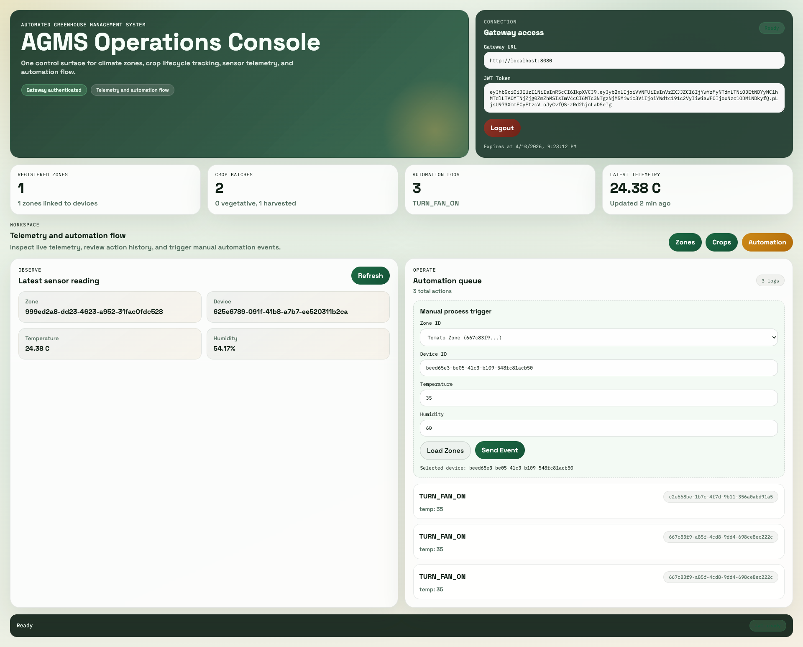
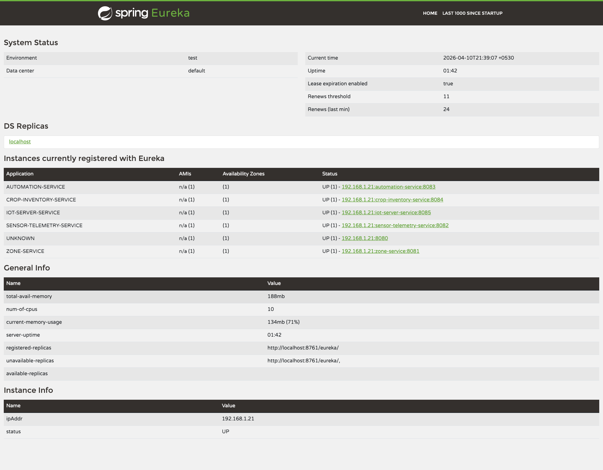

# Automated Greenhouse Management System (AGMS)

AGMS is a microservice-based application built with Spring Boot and Spring Cloud.

## Services and Ports

### Infrastructure
- `service-registry` (Eureka): `8761`
- `config-server` (Spring Cloud Config): `8888`
- `api-gateway` (Spring Cloud Gateway): `8080`

### Domain
- `iot-server-service`: `8085`
- `zone-service`: `8081`
- `sensor-telemetry-service`: `8082`
- `automation-service`: `8083`
- `crop-inventory-service`: `8084`

## Implemented Assignment Features

- Microservice architecture with infrastructure services and 4 domain services
- Eureka service registration and discovery setup
- Centralized configuration with config-repo files
- Gateway routes for zone, sensor, automation, and crop APIs
- Gateway routes for IoT auth/device APIs (`/api/auth/**`, `/api/devices/**`)
- Gateway JWT validation for missing/malformed/expired tokens
- Zone service CRUD with threshold validation (`minTemp < maxTemp`)
- Zone integration with internal IoT server API to register device and store `deviceId`
- Sensor scheduler (every 10 seconds) to fetch telemetry from internal IoT server API and push events
- Automation rule engine and log endpoint
- Crop lifecycle APIs with status transitions

## Startup Order

1. Start `service-registry`
2. Start `config-server`
3. Start `api-gateway`
4. Start `iot-server-service`
5. Start `zone-service`
6. Start `automation-service`
7. Start `sensor-telemetry-service`
8. Start `crop-inventory-service`

## Run Commands

Run each module from project root:

```bash
mvn -pl infrastructure/service-registry spring-boot:run
mvn -pl infrastructure/config-server spring-boot:run
mvn -pl infrastructure/api-gateway spring-boot:run
mvn -pl services/iot-server-service spring-boot:run
mvn -pl services/zone-service spring-boot:run
mvn -pl services/automation-service spring-boot:run
mvn -pl services/sensor-telemetry-service spring-boot:run
mvn -pl services/crop-inventory-service spring-boot:run
```

## Frontend (React Dashboard)

Start frontend from root directory:

```bash
cd frontend
npm install
npm run dev
```

Frontend URL:

- `http://localhost:5173`

In UI connection panel:

- Gateway URL: `http://localhost:8080`
- JWT Token: paste valid Bearer token value

Default IoT seed credentials for local development:

- Username: `agms_user`
- Password: `123456`

## API Testing

- Import: `postman/AGMS.postman_collection.json`
- Set Postman variables:
	- `gatewayUrl = http://localhost:8080`
	- `token = <your JWT token>`

## Submission Evidence

- Postman collection is included in `postman/`

## Screenshots

### Frontend









### Eureka


